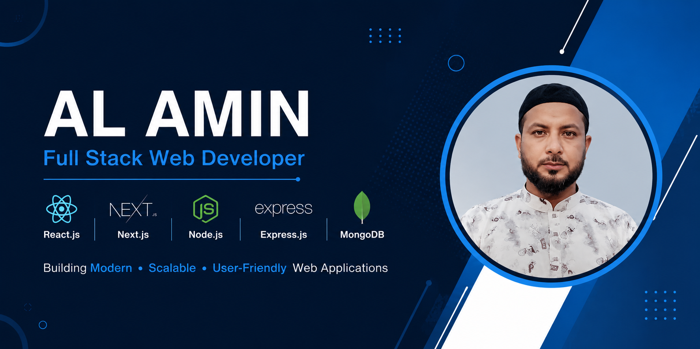

[](https://github.com/arifislam121416)  [](https://dev.to/al-amin-arif2785)  [](https://www.linkedin.com/in/al-amin-arif2785/)  [](https://www.facebook.com/https://web.facebook.com/profile.php?id=61575087596429)  [](https://twitter.com/al-amin-arif2785)  [](https://codepen.io/al-amin-arif2785)  [](https://www.youtube.com/channel/@bdhealthtip)  [](https://www.reddit.com/user/al-amin-arif2785)  [](al-amin-arif2785)  


<p align="center">
  
</p>

# 👋 Hi, I'm AL AMIN

<h3 align="center">
  Full-Stack Web Developer | React.js | Next.js | Node.js | MongoDB
</h3>

<p align="center">
  
</p>

<p align="center">
  <a href="https://alamin-dev-xk6u.vercel.app/">
    
  </a>
  <a href="https://www.linkedin.com/in/al-amin-arif2785/">
    
  </a>
  <a href="mailto:alaminfreelancer1997@gmail.com">
    
  </a>
</p>

---

## 🚀 About Me

I'm **AL AMIN**, a passionate **Full-Stack Web Developer** from **Dhaka, Bangladesh**, focused on building modern, responsive, and user-friendly web applications.

I enjoy turning ideas into functional digital products using modern JavaScript technologies. I have hands-on experience with frontend development, backend API development, authentication, authorization, database integration, dashboards, booking systems, payment integration, and deployment.

- 🔭 Currently building and improving full-stack web applications
- 🌱 Continuously learning modern web technologies
- 💻 Experienced with React.js, Next.js, Node.js, Express.js and MongoDB
- 🔐 Interested in authentication, authorization and secure application development
- 🚀 Experienced with Vercel deployment and Git/GitHub workflows
- 🎯 Career goal: Grow as a professional Full-Stack Web Developer
- 📍 Based in Dhaka, Bangladesh

---

## 🛠️ Technologies & Tools

### 👨‍💻 Languages

<p>
  
</p>

### 🎨 Frontend

<p>
  
</p>

**Also experienced with:** DaisyUI, HeroUI, React Hook Form, Framer Motion, Swiper.js, React Icons, React Hot Toast.

### ⚙️ Backend

<p>
  
</p>

**Experience:** REST APIs, API Integration, CRUD Operations, Middleware, Protected APIs.

### 🗄️ Database

<p>
  
</p>

**Experience:** MongoDB, MongoDB Atlas, Database Integration, CRUD Operations.

### 🔐 Authentication & Security

- Better Auth
- Google OAuth
- JWT
- Protected Routes
- Role-Based Authorization
- Authentication & Authorization

### 💳 Payment & API

- Stripe Checkout
- Axios
- REST API

### 📊 Libraries

- Recharts
- Framer Motion
- Swiper.js
- React Hot Toast
- React Icons

### 🧰 Tools & Deployment

<p>
  
</p>

---

# 🌟 Featured Projects

## 🎫 TicketHub — Online Ticket Booking Platform

<p align="center">
  
  
  
  
  
</p>

A full-stack ticket booking platform designed for **Users, Vendors, and Admins**.

### ✨ Key Features

- 🔐 Email/password and Google authentication
- 👥 User, Vendor and Admin role-based dashboards
- 🎟️ Ticket search, filtering, sorting and pagination
- 📋 Ticket details and booking management
- 💳 Stripe Checkout payment integration
- 📊 Vendor revenue statistics
- 🛠️ Admin ticket approval and user management
- 📱 Fully responsive UI
- 🔒 Protected routes and JWT-protected APIs

### 🔗 Links

**Live Demo:**  
https://ticket-hub-p6hh.vercel.app/

**GitHub:**  
https://github.com/arifislam121416/TicketHub

---

## 📚 MediQueue — Tutorial Booking Platform

<p align="center">
  
  
  
  
  
</p>

A full-stack tutorial booking platform where students can browse tutorials, book sessions, enroll in courses, and manage their learning journey.

### ✨ Key Features

- 🔐 Email/password authentication
- 🔑 Google OAuth authentication
- 🛡️ Protected routes and middleware
- 📚 Tutorial search and management
- 📅 Session booking
- 🎓 Course enrollment
- 👤 Personal dashboard
- 🗄️ MongoDB integration
- 📱 Responsive design

### 🔗 Links

**Live Demo:**  
https://medique-client-mu.vercel.app/

**GitHub:**  
https://github.com/arifislam121416/mediqueflow-client

---

## 🎓 SkillSphere — Online Learning Platform

<p align="center">
  
  
  
  
</p>

A modern online learning platform for discovering courses, viewing protected course details, and managing user profiles.

### ✨ Key Features

- 🔐 Better Auth authentication
- 🔒 Protected course details
- 🔎 Course search
- 👤 Profile management
- 🔥 Trending courses
- 👨‍🏫 Instructor section
- 🔔 Toast notifications
- ⏳ Loading states
- 📱 Responsive design
- ❌ Custom 404 page
- ☁️ Vercel deployment

### 🔗 Links

**Live Demo:**  
https://skillsphere-e-course-platform.vercel.app/

**GitHub:**  
https://github.com/arifislam121416/skillsphere-E-Course-Platform

---

# 📈 GitHub Statistics

<p align="center">
  
  
</p>

---

# 🔥 GitHub Streak

<p align="center">
  
</p>

---

# 🐍 Contribution Activity

<p align="center">
  
</p>

---

# 🎓 Education

### Master of Arts (M.A.)
**National University, Bangladesh**

---

# 📜 Professional Training

### Programming Hero
**Complete Web Development Course**

Successfully completed the Complete Web Development Course with practical experience in modern frontend and backend web development technologies.

---

# 💡 What I Can Do

```text
✓ Build responsive web applications
✓ Develop modern React & Next.js applications
✓ Build RESTful APIs with Node.js & Express.js
✓ Integrate MongoDB databases
✓ Implement authentication & authorization
✓ Build role-based dashboards
✓ Integrate payment systems
✓ Create protected routes
✓ Integrate third-party APIs
✓ Deploy applications with Vercel
✓ Manage projects with Git & GitHub

